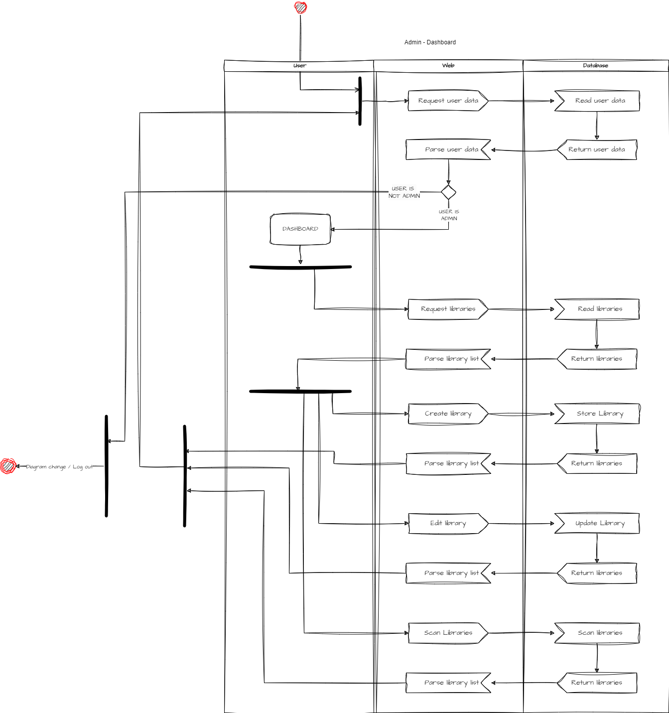
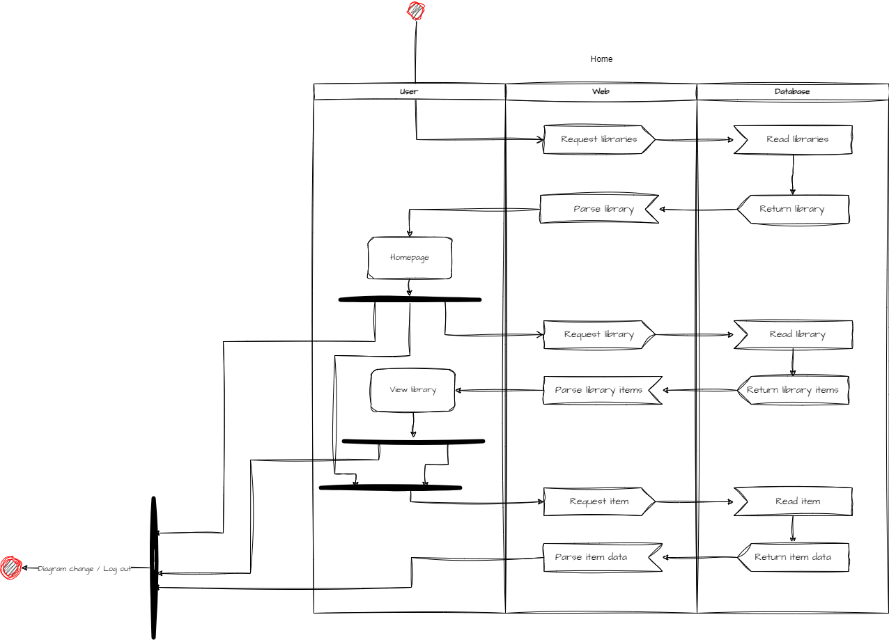
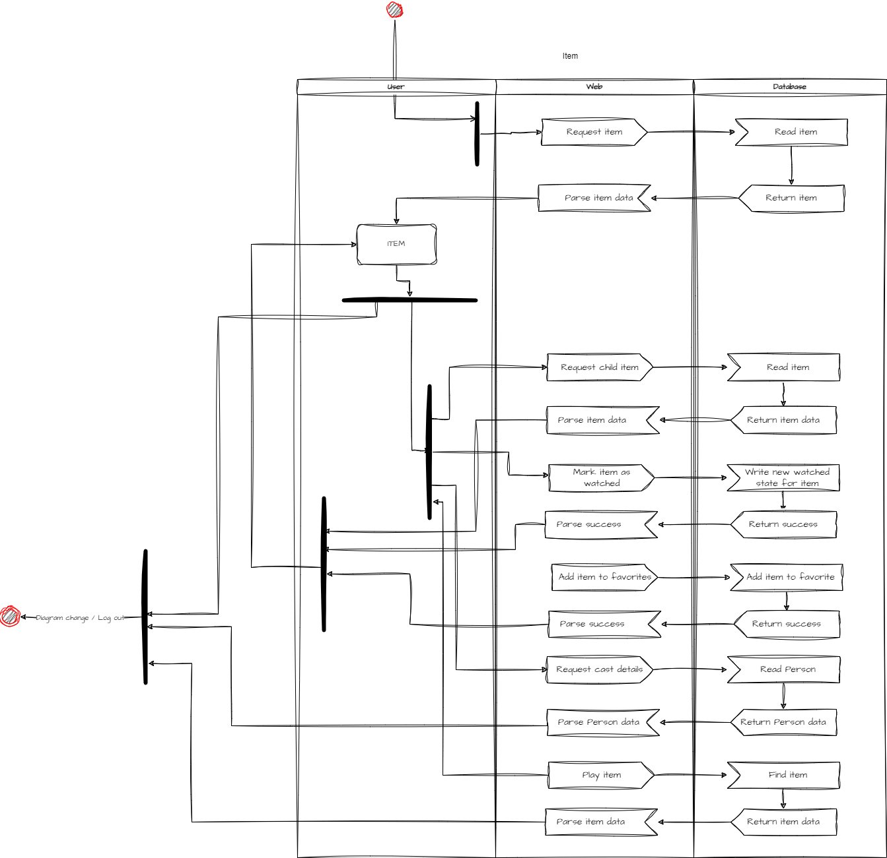
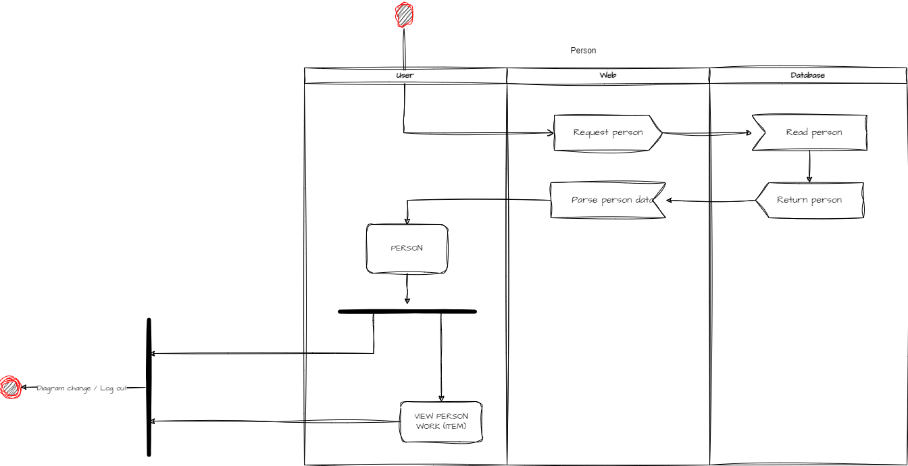
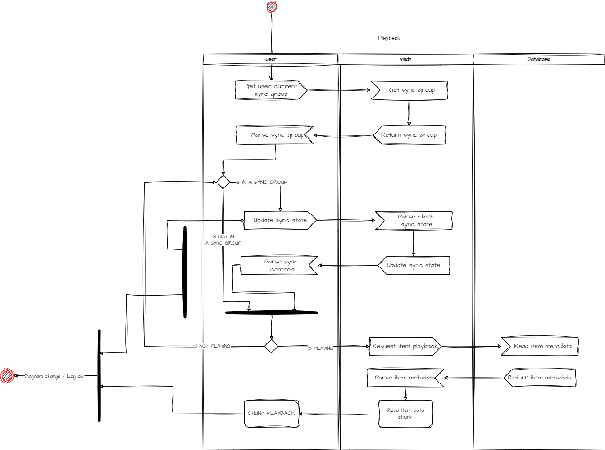
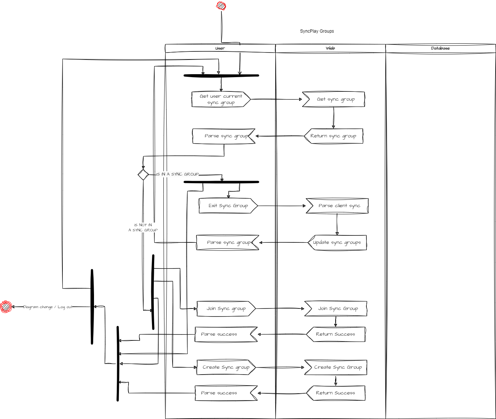
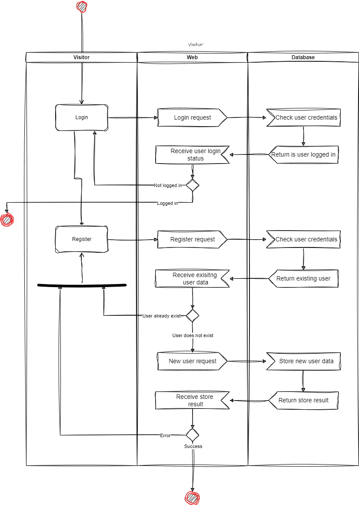
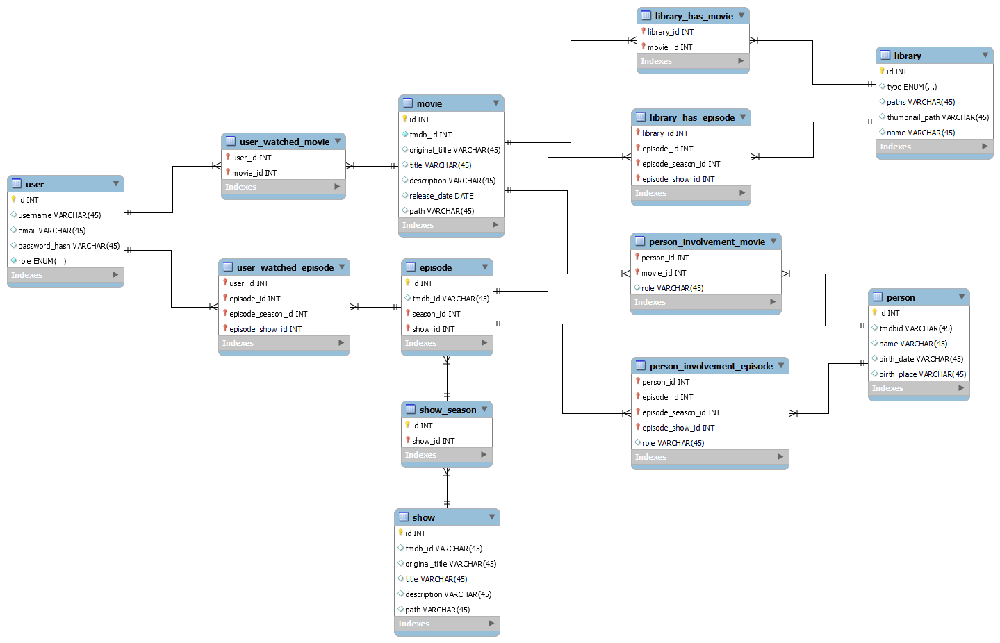
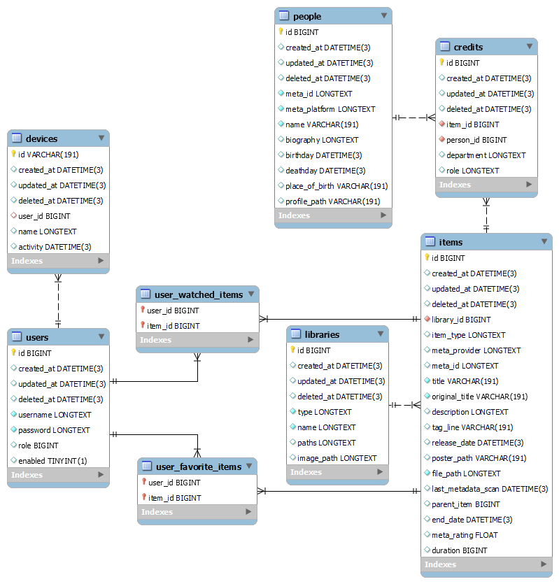

# projecte-final-daw

Back in the days where there was no Netflix or any other video streaming, people usually had their own media library. Containing boxes of movies or seasons of a TV show. Today, although the vast majority uses video streaming for a regular basis, some still prefer to own their content, so they still have a physical library.
This project aims to that people that still own their content, and have a physical based library. We can help and improve their media consumption experience by making possible to consume it at any time anywhere as long as there is an internet connection.

# Functional Requirements
-	Responsive frontend (Mobile, Tablet, Desktop)
-	Login and Register
-	Local Disk Libraries
-	Movie Metadata from external API
-	Custom Video Player
-	Multiple Database Support
-	Admin Panel
-	Auto installer (web based setup process)
-	DLNA (send video to devices)
-	SyncPlay

# Technical Requirements
## Developer
- Backend
    - GO 1.22
        - Air (Automatically rebuild when saving a file)
        - Templ (Template generator CLI tool)
    - Database (Supported by GORM, could be SQLite, MySQL, PostgreSQL)
    - Sass
    - Node.js
    - FFMpeg installed in PATH
-	Frontend
    - JQuery
    - Google Icons
    - Sweetalert2
    - Isotope
    - ImagesLoaded
## User
-	Binary file (GO program compiled containing the backend and the frontend)
-	Database (Supported by GORM, could be SQLite, MySQL, PostgreSQL)
-	FFMpeg installed in PATH
# Diagrams
## Use Case
### Admin

### User

### Visitor

## Activity
### Admin

### User

### Visitor

## Database
### V1

### V3

## Class

> **_NOTE_** It is recomended to open this diagram itself to have a better visualization.